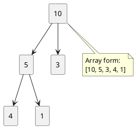
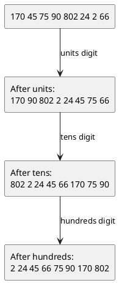
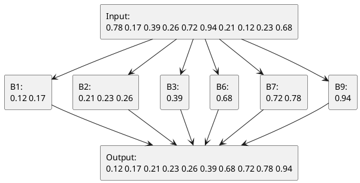

```plantuml
@startuml
left to right direction
skinparam shadowing false
skinparam rectangle {
  RoundCorner 0
}

rectangle "23" as sh1
rectangle "12" as sh2
rectangle "1" as sh3
rectangle "8" as sh4
rectangle "34" as sh5
rectangle "54" as sh6
rectangle "2" as sh7
rectangle "3" as sh8

sh1 -[hidden]right-> sh2
sh2 -[hidden]right-> sh3
sh3 -[hidden]right-> sh4
sh4 -[hidden]right-> sh5
sh5 -[hidden]right-> sh6
sh6 -[hidden]right-> sh7
sh7 -[hidden]right-> sh8

sh1 ..> sh5 : gap 4
sh2 ..> sh6 : gap 4
sh3 ..> sh7 : gap 4
sh4 ..> sh8 : gap 4
@enduml
```

```plantuml
@startuml
left to right direction
skinparam shadowing false
skinparam rectangle {
  RoundCorner 0
}

package "Input A" {
  rectangle "4" as c1
  rectangle "2" as c2
  rectangle "2" as c3
  rectangle "8" as c4
  rectangle "3" as c5
  rectangle "3" as c6
  rectangle "1" as c7
  c1 -[hidden]right-> c2
  c2 -[hidden]right-> c3
  c3 -[hidden]right-> c4
  c4 -[hidden]right-> c5
  c5 -[hidden]right-> c6
  c6 -[hidden]right-> c7
}

package "Count C" {
  rectangle "0:0" as d0
  rectangle "1:1" as d1
  rectangle "2:2" as d2
  rectangle "3:2" as d3
  rectangle "4:1" as d4
  rectangle "5:0" as d5
  rectangle "6:0" as d6
  rectangle "7:0" as d7
  rectangle "8:1" as d8
  d0 -[hidden]right-> d1
  d1 -[hidden]right-> d2
  d2 -[hidden]right-> d3
  d3 -[hidden]right-> d4
  d4 -[hidden]right-> d5
  d5 -[hidden]right-> d6
  d6 -[hidden]right-> d7
  d7 -[hidden]right-> d8
}
@enduml
```

# Data Structures — Using C

## Contents
1. [Introduction](#introduction)
2. [Standard Notation Used in this Note](#standard-notation-used-in-this-note)
3. [Classification of Sorting](#classification-of-sorting)
4. [Bubble Sort](#1-bubble-sort)
5. [Selection Sort](#2-selection-sort)
6. [Insertion Sort](#3-insertion-sort)
7. [Merge Sort](#4-merge-sort)
8. [Quick Sort](#5-quick-sort)
9. [Heap Sort](#6-heap-sort)
10. [Shell Sort](#7-shell-sort)
11. [Counting Sort](#8-counting-sort)
12. [Radix Sort](#9-radix-sort)
13. [Bucket Sort](#10-bucket-sort)
14. [Comparison Table](#comparison-table)
15. [General Exercises](#general-exercises)

---

## Introduction

**Sorting** is the process of arranging records or keys in a specified order, usually ascending or descending.

Sorting is important because it:
- improves searching efficiency,
- simplifies merging and reporting,
- helps in duplicate detection,
- is used in databases, operating systems, compilers, and indexing systems.

---

## Standard Notation Used in this Note

 The algorithms below use **formal pseudocode notation**:

- Procedure names are written in uppercase, such as `MERGE-SORT`.
- Assignment is written using `←`.
- Pseudocode uses **1-based indexing** where convenient.
- The C programs use normal **0-based indexing**.
- For exam writing, you may copy either the pseudocode or the C logic.

**Important terms**
- **Stable sort**: equal elements preserve their relative order.
- **In-place sort**: requires only a small constant extra memory.
- **Comparison sort**: order is decided by comparing keys.
- **Non-comparison sort**: uses counts, digits, or buckets instead of only comparisons.

---

## Classification of Sorting

### 1. Comparison-based sorting
- Bubble Sort
- Selection Sort
- Insertion Sort
- Merge Sort
- Quick Sort
- Heap Sort
- Shell Sort

### 2. Non-comparison sorting
- Counting Sort
- Radix Sort
- Bucket Sort

---

# 1. Bubble Sort

## Concept

Bubble Sort repeatedly compares adjacent elements and exchanges them if they are out of order.  
After each pass, the largest element of the unsorted portion moves to its correct final position.

- **Method**: exchange sort
- **Stable**: yes
- **In-place**: yes

## Standard Algorithm

```text
BUBBLE-SORT(A, n)
for i ← 1 to n - 1
    swapped ← FALSE
    for j ← 1 to n - i
        if A[j] > A[j + 1]
            exchange A[j] and A[j + 1]
            swapped ← TRUE
    if swapped = FALSE
        return
```

## Example with Explanation

Let:

```text
A = [29, 10, 14, 37, 13]
```

### Pass 1
- Compare 29 and 10 → swap
- Compare 29 and 14 → swap
- Compare 29 and 37 → no swap
- Compare 37 and 13 → swap

Array after pass 1:

```text
[10, 14, 29, 13, 37]
```

### Pass 2
- Compare 10 and 14 → no swap
- Compare 14 and 29 → no swap
- Compare 29 and 13 → swap

Array after pass 2:

```text
[10, 14, 13, 29, 37]
```

### Pass 3
- Compare 10 and 14 → no swap
- Compare 14 and 13 → swap

Array after pass 3:

```text
[10, 13, 14, 29, 37]
```

## Exam Diagram (Illustrative Array Diagram)

```text
Initial array
Index :   0      1      2      3      4
        +----+ +----+ +----+ +----+ +----+
A     = | 29 | | 10 | | 14 | | 37 | | 13 |
        +----+ +----+ +----+ +----+ +----+

Pass 1: compare A[0] and A[1]
        +----+   ↔   +----+
        | 29 |  swap | 10 |
        +----+       +----+

After swap
        +----+ +----+ +----+ +----+ +----+
        | 10 | | 29 | | 14 | | 37 | | 13 |
        +----+ +----+ +----+ +----+ +----+

Pass 1: compare A[1] and A[2]
        +----+   ↔   +----+
        | 29 |  swap | 14 |
        +----+       +----+

After swap
        +----+ +----+ +----+ +----+ +----+
        | 10 | | 14 | | 29 | | 37 | | 13 |
        +----+ +----+ +----+ +----+ +----+

Pass 1: compare A[3] and A[4]
        +----+   ↔   +----+
        | 37 |  swap | 13 |
        +----+       +----+

After pass 1
        +----+ +----+ +----+ +----+ +----+
        | 10 | | 14 | | 29 | | 13 | | 37 |
        +----+ +----+ +----+ +----+ +----+
                                      final

Final sorted array
        +----+ +----+ +----+ +----+ +----+
        | 10 | | 13 | | 14 | | 29 | | 37 |
        +----+ +----+ +----+ +----+ +----+
```

## Diagram


## Program Using C

```c
#include <stdio.h>

void bubbleSort(int A[], int n) {
    int i, j, temp, swapped;
    for (i = 0; i < n - 1; i++) {
        swapped = 0;
        for (j = 0; j < n - 1 - i; j++) {
            if (A[j] > A[j + 1]) {
                temp = A[j];
                A[j] = A[j + 1];
                A[j + 1] = temp;
                swapped = 1;
            }
        }
        if (!swapped)
            break;
    }
}

void printArray(int A[], int n) {
    int i;
    for (i = 0; i < n; i++)
        printf("%d ", A[i]);
    printf("\n");
}

int main() {
    int A[] = {29, 10, 14, 37, 13};
    int n = sizeof(A) / sizeof(A[0]);

    bubbleSort(A, n);
    printArray(A, n);
    return 0;
}
```

## Time Complexity

- Best case: `O(n)` with swapped flag
- Average case: `O(n^2)`
- Worst case: `O(n^2)`
- Space complexity: `O(1)`

## Exercises

1. Perform Bubble Sort on `8, 3, 5, 1, 9`.
2. Why is Bubble Sort called stable?
3. Modify Bubble Sort to sort in descending order.

---

# 2. Selection Sort

## Concept

Selection Sort repeatedly selects the smallest element from the unsorted portion and places it at the beginning of that portion.

- **Method**: selection sort
- **Stable**: no (in ordinary form)
- **In-place**: yes

## Standard Algorithm

```text
SELECTION-SORT(A, n)
for i ← 1 to n - 1
    min ← i
    for j ← i + 1 to n
        if A[j] < A[min]
            min ← j
    if min ≠ i
        exchange A[i] and A[min]
```

## Example with Explanation

Let:

```text
A = [29, 10, 14, 37, 13]
```

### Pass 1
Smallest element in positions 1..5 is `10`.  
Exchange `29` and `10`.

```text
[10, 29, 14, 37, 13]
```

### Pass 2
Smallest element in positions 2..5 is `13`.  
Exchange `29` and `13`.

```text
[10, 13, 14, 37, 29]
```

### Pass 3
Smallest element in positions 3..5 is `14`. No change.

### Pass 4
Smallest element in positions 4..5 is `29`.  
Exchange `37` and `29`.

```text
[10, 13, 14, 29, 37]
```

## Exam Diagram

```text
Initial array
Index :   0      1      2      3      4
        +----+ +----+ +----+ +----+ +----+
A     = | 29 | | 10 | | 14 | | 37 | | 13 |
        +----+ +----+ +----+ +----+ +----+

Pass 1: find minimum in entire unsorted array
          min
           ↓
        +----+ +----+ +----+ +----+ +----+
        | 29 | | 10 | | 14 | | 37 | | 13 |
        +----+ +----+ +----+ +----+ +----+
                 ↑ smallest

Swap A[0] and A[1]
        +----+   ↔   +----+
        | 29 |  swap | 10 |
        +----+       +----+

After pass 1
        +----+ | +----+ +----+ +----+ +----+
        | 10 | | | 29 | | 14 | | 37 | | 13 |
        +----+ | +----+ +----+ +----+ +----+
        sorted |       unsorted

After complete sorting
        +----+ +----+ +----+ +----+ +----+
        | 10 | | 13 | | 14 | | 29 | | 37 |
        +----+ +----+ +----+ +----+ +----+
```

##  Diagram


## Program Using C

```c
#include <stdio.h>

void selectionSort(int A[], int n) {
    int i, j, min, temp;
    for (i = 0; i < n - 1; i++) {
        min = i;
        for (j = i + 1; j < n; j++) {
            if (A[j] < A[min])
                min = j;
        }
        if (min != i) {
            temp = A[i];
            A[i] = A[min];
            A[min] = temp;
        }
    }
}

void printArray(int A[], int n) {
    int i;
    for (i = 0; i < n; i++)
        printf("%d ", A[i]);
    printf("\n");
}

int main() {
    int A[] = {29, 10, 14, 37, 13};
    int n = sizeof(A) / sizeof(A[0]);

    selectionSort(A, n);
    printArray(A, n);
    return 0;
}
```

## Time Complexity

- Best case: `O(n^2)`
- Average case: `O(n^2)`
- Worst case: `O(n^2)`
- Space complexity: `O(1)`

## Exercises

1. Apply Selection Sort on `64, 25, 12, 22, 11`.
2. Why does Selection Sort perform fewer swaps than Bubble Sort?
3. Is Selection Sort stable in its basic form? Explain.

---

# 3. Insertion Sort

## Concept

Insertion Sort builds the final sorted array one element at a time by inserting each new key into its proper position in the already sorted left portion.

- **Method**: insertion by shifting
- **Stable**: yes
- **In-place**: yes

## Standard Algorithm

```text
INSERTION-SORT(A, n)
for j ← 2 to n
    key ← A[j]
    i ← j - 1
    while i > 0 and A[i] > key
        A[i + 1] ← A[i]
        i ← i - 1
    A[i + 1] ← key
```

## Example with Explanation

Let:

```text
A = [29, 10, 14, 37, 13]
```

### Step 1: Insert 10 into sorted portion [29]
- Shift 29 one position right.
- Insert 10.

```text
[10, 29, 14, 37, 13]
```

### Step 2: Insert 14 into sorted portion [10, 29]
- Shift 29 one position right.
- Insert 14 after 10.

```text
[10, 14, 29, 37, 13]
```

### Step 3: Insert 37
Already greater than 29, so no shift.

### Step 4: Insert 13
- Shift 37 right
- Shift 29 right
- Shift 14 right
- Insert 13 after 10

```text
[10, 13, 14, 29, 37]
```

## Exam Diagram

```text
Initial array
        +----+ +----+ +----+ +----+ +----+
        | 29 | | 10 | | 14 | | 37 | | 13 |
        +----+ +----+ +----+ +----+ +----+

Insert key = 10 into sorted part [29]

Before shifting
        +----+ +----+
        | 29 | | 10 |
        +----+ +----+

Shift 29 one place right
               ─────────►
        +----+ +----+
        | 29 | | 29 |
        +----+ +----+

Insert key 10
        +----+ +----+
        | 10 | | 29 |
        +----+ +----+

Insert key = 13 into [10, 14, 29, 37]

        +----+ +----+ +----+ +----+ +----+
        | 10 | | 14 | | 29 | | 37 | | 13 |
        +----+ +----+ +----+ +----+ +----+

Shift 37 right      Shift 29 right      Shift 14 right
             ───►                ───►               ───►

Result
        +----+ +----+ +----+ +----+ +----+
        | 10 | | 13 | | 14 | | 29 | | 37 |
        +----+ +----+ +----+ +----+ +----+
```

## Diagram


## Program Using C

```c
#include <stdio.h>

void insertionSort(int A[], int n) {
    int j, key, i;
    for (j = 1; j < n; j++) {
        key = A[j];
        i = j - 1;
        while (i >= 0 && A[i] > key) {
            A[i + 1] = A[i];
            i--;
        }
        A[i + 1] = key;
    }
}

void printArray(int A[], int n) {
    int i;
    for (i = 0; i < n; i++)
        printf("%d ", A[i]);
    printf("\n");
}

int main() {
    int A[] = {29, 10, 14, 37, 13};
    int n = sizeof(A) / sizeof(A[0]);

    insertionSort(A, n);
    printArray(A, n);
    return 0;
}
```

## Time Complexity

- Best case: `O(n)`
- Average case: `O(n^2)`
- Worst case: `O(n^2)`
- Space complexity: `O(1)`

## Exercises

1. Perform Insertion Sort on `5, 2, 4, 6, 1, 3`.
2. Why is Insertion Sort efficient for small or nearly sorted arrays?
3. Show all shifts while inserting the key `7` into `[2, 4, 6, 8, 10]`.

---

# 4. Merge Sort

## Concept

Merge Sort follows the **divide-and-conquer** technique.

1. Divide the array into two halves.
2. Recursively sort each half.
3. Merge the sorted halves.

- **Method**: divide and conquer
- **Stable**: yes
- **In-place**: no (standard array implementation uses extra space)

## Standard Algorithm

```text
MERGE-SORT(A, p, r)
if p < r
    q ← ⌊(p + r) / 2⌋
    MERGE-SORT(A, p, q)
    MERGE-SORT(A, q + 1, r)
    MERGE(A, p, q, r)
```

```text
MERGE(A, p, q, r)
n1 ← q - p + 1
n2 ← r - q
create arrays L[1..n1] and R[1..n2]

for i ← 1 to n1
    L[i] ← A[p + i - 1]
for j ← 1 to n2
    R[j] ← A[q + j]

i ← 1
j ← 1
k ← p

while i ≤ n1 and j ≤ n2
    if L[i] ≤ R[j]
        A[k] ← L[i]
        i ← i + 1
    else
        A[k] ← R[j]
        j ← j + 1
    k ← k + 1

while i ≤ n1
    A[k] ← L[i]
    i ← i + 1
    k ← k + 1

while j ≤ n2
    A[k] ← R[j]
    j ← j + 1
    k ← k + 1
```

## Example with Explanation

Let:

```text
A = [38, 27, 43, 3, 9, 82, 10]
```

### Divide
```text
[38, 27, 43, 3, 9, 82, 10]
→ [38, 27, 43, 3] and [9, 82, 10]
→ [38, 27] [43, 3] [9] [82, 10]
→ [38] [27] [43] [3] [9] [82] [10]
```

### Merge
```text
[38] + [27] → [27, 38]
[43] + [3]  → [3, 43]
[82] + [10] → [10, 82]

[27, 38] + [3, 43] → [3, 27, 38, 43]
[9] + [10, 82]     → [9, 10, 82]

[3, 27, 38, 43] + [9, 10, 82]
→ [3, 9, 10, 27, 38, 43, 82]
```

## Exam Diagram

```text
                         [38 27 43 3 9 82 10]
                         /                  \
              [38 27 43 3]                [9 82 10]
               /        \                  /      \
          [38 27]      [43 3]            [9]    [82 10]
           /   \        /   \                    /    \
        [38] [27]    [43] [3]                 [82]  [10]

Merge upward:
[38] + [27]   -> [27 38]
[43] + [3]    -> [3 43]
[82] + [10]   -> [10 82]

[27 38] + [3 43]  -> [3 27 38 43]
[9] + [10 82]     -> [9 10 82]

Final:
[3 27 38 43] + [9 10 82] -> [3 9 10 27 38 43 82]
```

## Diagram


## Program Using C

```c
#include <stdio.h>

void merge(int A[], int low, int mid, int high) {
    int i, j, k;
    int n1 = mid - low + 1;
    int n2 = high - mid;

    int L[100], R[100];

    for (i = 0; i < n1; i++)
        L[i] = A[low + i];
    for (j = 0; j < n2; j++)
        R[j] = A[mid + 1 + j];

    i = 0;
    j = 0;
    k = low;

    while (i < n1 && j < n2) {
        if (L[i] <= R[j])
            A[k++] = L[i++];
        else
            A[k++] = R[j++];
    }

    while (i < n1)
        A[k++] = L[i++];

    while (j < n2)
        A[k++] = R[j++];
}

void mergeSort(int A[], int low, int high) {
    int mid;
    if (low < high) {
        mid = (low + high) / 2;
        mergeSort(A, low, mid);
        mergeSort(A, mid + 1, high);
        merge(A, low, mid, high);
    }
}

void printArray(int A[], int n) {
    int i;
    for (i = 0; i < n; i++)
        printf("%d ", A[i]);
    printf("\n");
}

int main() {
    int A[] = {38, 27, 43, 3, 9, 82, 10};
    int n = sizeof(A) / sizeof(A[0]);

    mergeSort(A, 0, n - 1);
    printArray(A, n);
    return 0;
}
```

## Time Complexity

- Best case: `O(n log n)`
- Average case: `O(n log n)`
- Worst case: `O(n log n)`
- Space complexity: `O(n)`

## Exercises

1. Draw the recursion tree for Merge Sort on `8, 4, 2, 6, 1, 3`.
2. Why is Merge Sort stable?
3. Why is Merge Sort preferred for linked lists?

---

# 5. Quick Sort

## Concept

Quick Sort also follows **divide-and-conquer**.  
It selects a **pivot**, partitions the array into elements smaller and larger than the pivot, and recursively sorts the partitions.

- **Method**: partition-exchange sort
- **Stable**: no
- **In-place**: yes (ignoring recursion stack)

## Standard Algorithm

```text
QUICKSORT(A, p, r)
if p < r
    q ← PARTITION(A, p, r)
    QUICKSORT(A, p, q - 1)
    QUICKSORT(A, q + 1, r)
```

```text
PARTITION(A, p, r)
x ← A[r]
i ← p - 1
for j ← p to r - 1
    if A[j] ≤ x
        i ← i + 1
        exchange A[i] and A[j]
exchange A[i + 1] and A[r]
return i + 1
```

## Example with Explanation

Let:

```text
A = [10, 80, 30, 90, 40, 50, 70]
```

Take last element `70` as pivot.

### Partition
Elements `≤ 70` move to the left:
- 10 stays
- 80 stays
- 30 moves left side
- 90 stays
- 40 moves left side
- 50 moves left side

After final pivot exchange:

```text
[10, 30, 40, 50, 70, 90, 80]
```

Now `70` is at correct position.  
Recursively sort left and right subarrays.

## Exam Diagram

```text
Initial array
        +----+ +----+ +----+ +----+ +----+ +----+ +----+
        | 10 | | 80 | | 30 | | 90 | | 40 | | 50 | | 70 |
        +----+ +----+ +----+ +----+ +----+ +----+ +----+
                                                   pivot

During partition around pivot = 70

30 moves to left of pivot region
80 and 30 exchange positions
        +----+   ↔   +----+
        | 80 |  swap | 30 |
        +----+       +----+

40 moves left
90 and 40 exchange positions
        +----+   ↔   +----+
        | 90 |  swap | 40 |
        +----+       +----+

50 moves left
        +----+   ↔   +----+
        | 80 |  swap | 50 |
        +----+       +----+

Final pivot exchange
        +----+   ↔   +----+
        | 90 |  swap | 70 |
        +----+       +----+

After partition
        +----+ +----+ +----+ +----+ +----+ +----+ +----+
        | 10 | | 30 | | 40 | | 50 | | 70 | | 90 | | 80 |
        +----+ +----+ +----+ +----+ +----+ +----+ +----+
                                left    pivot   right
```

## Diagram


## Program Using C

```c
#include <stdio.h>

int partition(int A[], int low, int high) {
    int pivot = A[high];
    int i = low - 1;
    int j, temp;

    for (j = low; j < high; j++) {
        if (A[j] <= pivot) {
            i++;
            temp = A[i];
            A[i] = A[j];
            A[j] = temp;
        }
    }

    temp = A[i + 1];
    A[i + 1] = A[high];
    A[high] = temp;

    return i + 1;
}

void quickSort(int A[], int low, int high) {
    int p;
    if (low < high) {
        p = partition(A, low, high);
        quickSort(A, low, p - 1);
        quickSort(A, p + 1, high);
    }
}

void printArray(int A[], int n) {
    int i;
    for (i = 0; i < n; i++)
        printf("%d ", A[i]);
    printf("\n");
}

int main() {
    int A[] = {10, 80, 30, 90, 40, 50, 70};
    int n = sizeof(A) / sizeof(A[0]);

    quickSort(A, 0, n - 1);
    printArray(A, n);
    return 0;
}
```

## Time Complexity

- Best case: `O(n log n)`
- Average case: `O(n log n)`
- Worst case: `O(n^2)` when pivot choice is poor
- Space complexity: `O(log n)` average recursion stack

## Exercises

1. Partition the array `9, 3, 7, 1, 8, 2, 5` using the last element as pivot.
2. Why is Quick Sort usually fast in practice?
3. What causes the worst case of Quick Sort?

---

# 6. Heap Sort

## Concept

Heap Sort uses a **binary heap** data structure.  
For ascending order, a **max-heap** is built first. Then the root is exchanged with the last element, heap size is reduced, and heap property is restored.

- **Method**: heap-based selection
- **Stable**: no
- **In-place**: yes

## Standard Algorithm

```text
HEAPSORT(A)
BUILD-MAX-HEAP(A)
for i ← length(A) downto 2
    exchange A[1] and A[i]
    heap-size(A) ← heap-size(A) - 1
    MAX-HEAPIFY(A, 1)
```

```text
BUILD-MAX-HEAP(A)
heap-size(A) ← length(A)
for i ← ⌊length(A) / 2⌋ downto 1
    MAX-HEAPIFY(A, i)
```

```text
MAX-HEAPIFY(A, i)
l ← LEFT(i)
r ← RIGHT(i)
largest ← i

if l ≤ heap-size(A) and A[l] > A[largest]
    largest ← l
if r ≤ heap-size(A) and A[r] > A[largest]
    largest ← r
if largest ≠ i
    exchange A[i] and A[largest]
    MAX-HEAPIFY(A, largest)
```

## Example with Explanation

Let:

```text
A = [4, 10, 3, 5, 1]
```

### Build max-heap
Heap becomes:

```text
[10, 5, 3, 4, 1]
```

### First extraction
Exchange root and last element:

```text
[1, 5, 3, 4, 10]
```

Restore heap property:

```text
[5, 4, 3, 1, 10]
```

Continue until sorted:

```text
[1, 3, 4, 5, 10]
```

## Exam Diagram

```text
Array form:
        +----+ +----+ +----+ +----+ +----+
        |  4 | | 10 | |  3 | |  5 | |  1 |
        +----+ +----+ +----+ +----+ +----+

Corresponding complete binary tree

                4
              /   \
            10     3
           /  \
          5    1

After building max-heap

               10
              /   \
             5     3
            / \
           4   1

Array form:
        +----+ +----+ +----+ +----+ +----+
        | 10 | |  5 | |  3 | |  4 | |  1 |
        +----+ +----+ +----+ +----+ +----+

Swap root with last element
        +----+   ↔   +----+
        | 10 |  swap |  1 |
        +----+       +----+

After final sorting
        +----+ +----+ +----+ +----+ +----+
        |  1 | |  3 | |  4 | |  5 | | 10 |
        +----+ +----+ +----+ +----+ +----+
```

## PlantUML Code for Diagram



## Program Using C

```c
#include <stdio.h>

void heapify(int A[], int n, int i) {
    int largest = i;
    int left = 2 * i + 1;
    int right = 2 * i + 2;
    int temp;

    if (left < n && A[left] > A[largest])
        largest = left;
    if (right < n && A[right] > A[largest])
        largest = right;

    if (largest != i) {
        temp = A[i];
        A[i] = A[largest];
        A[largest] = temp;
        heapify(A, n, largest);
    }
}

void heapSort(int A[], int n) {
    int i, temp;
    for (i = n / 2 - 1; i >= 0; i--)
        heapify(A, n, i);

    for (i = n - 1; i > 0; i--) {
        temp = A[0];
        A[0] = A[i];
        A[i] = temp;
        heapify(A, i, 0);
    }
}

void printArray(int A[], int n) {
    int i;
    for (i = 0; i < n; i++)
        printf("%d ", A[i]);
    printf("\n");
}

int main() {
    int A[] = {4, 10, 3, 5, 1};
    int n = sizeof(A) / sizeof(A[0]);

    heapSort(A, n);
    printArray(A, n);
    return 0;
}
```

## Time Complexity

- Best case: `O(n log n)`
- Average case: `O(n log n)`
- Worst case: `O(n log n)`
- Space complexity: `O(1)`

## Exercises

1. Build a max-heap for `16, 14, 10, 8, 7, 9, 3, 2, 4, 1`.
2. Perform one extraction step of Heap Sort on the heap.
3. Why is Heap Sort not stable?

---

# 7. Shell Sort

## Concept

Shell Sort improves Insertion Sort by allowing exchanges of elements that are far apart.  
It sorts elements separated by a **gap**, then gradually reduces the gap until it becomes 1.

- **Method**: diminishing increment sort
- **Stable**: no
- **In-place**: yes

## Standard Algorithm

```text
SHELL-SORT(A, n)
gap ← ⌊n / 2⌋
while gap > 0
    for i ← gap + 1 to n
        temp ← A[i]
        j ← i
        while j > gap and A[j - gap] > temp
            A[j] ← A[j - gap]
            j ← j - gap
        A[j] ← temp
    gap ← ⌊gap / 2⌋
```

## Example with Explanation

Let:

```text
A = [23, 12, 1, 8, 34, 54, 2, 3]
```

### Gap = 4
Compare and sort groups:
- `(23, 34)`
- `(12, 54)`
- `(1, 2)`
- `(8, 3)`

Array becomes:

```text
[23, 12, 1, 3, 34, 54, 2, 8]
```

### Gap = 2
Sort elements 2 apart.

### Gap = 1
Final Insertion Sort gives the completely sorted array:

```text
[1, 2, 3, 8, 12, 23, 34, 54]
```

## Exam Diagram

```text
Initial array
        +----+ +----+ +----+ +----+ +----+ +----+ +----+ +----+
        | 23 | | 12 | |  1 | |  8 | | 34 | | 54 | |  2 | |  3 |
        +----+ +----+ +----+ +----+ +----+ +----+ +----+ +----+

Gap = 4 groups
Group 1: A[0], A[4] -> 23, 34
Group 2: A[1], A[5] -> 12, 54
Group 3: A[2], A[6] ->  1,  2
Group 4: A[3], A[7] ->  8,  3

Only group 4 changes
        +----+ +----+ +----+ +----+ +----+ +----+ +----+ +----+
        | 23 | | 12 | |  1 | |  3 | | 34 | | 54 | |  2 | |  8 |
        +----+ +----+ +----+ +----+ +----+ +----+ +----+ +----+

Gap = 1
Final array
        +----+ +----+ +----+ +----+ +----+ +----+ +----+ +----+
        |  1 | |  2 | |  3 | |  8 | | 12 | | 23 | | 34 | | 54 |
        +----+ +----+ +----+ +----+ +----+ +----+ +----+ +----+
```

## PlantUML Code for Diagram



## Program Using C

```c
#include <stdio.h>

void shellSort(int A[], int n) {
    int gap, i, j, temp;
    for (gap = n / 2; gap > 0; gap /= 2) {
        for (i = gap; i < n; i++) {
            temp = A[i];
            for (j = i; j >= gap && A[j - gap] > temp; j -= gap)
                A[j] = A[j - gap];
            A[j] = temp;
        }
    }
}

void printArray(int A[], int n) {
    int i;
    for (i = 0; i < n; i++)
        printf("%d ", A[i]);
    printf("\n");
}

int main() {
    int A[] = {23, 12, 1, 8, 34, 54, 2, 3};
    int n = sizeof(A) / sizeof(A[0]);

    shellSort(A, n);
    printArray(A, n);
    return 0;
}
```

## Time Complexity

Shell Sort complexity depends on the gap sequence.

- Best case: better than `O(n^2)` in practice
- Average case: depends on gap sequence
- Worst case: often written as `O(n^2)` for simple gap sequence `n/2, n/4, ...`
- Space complexity: `O(1)`

## Exercises

1. Perform Shell Sort on `9, 8, 3, 7, 5, 6, 4, 1`.
2. Why is Shell Sort faster than ordinary Insertion Sort?
3. What is the role of the gap sequence?

---

# 8. Counting Sort

## Concept

Counting Sort is used when the keys are integers in a small known range.  
Instead of comparing elements, it counts the occurrence of each key.

- **Method**: counting frequency
- **Stable**: yes (when cumulative counts are used correctly)
- **In-place**: no

## Standard Algorithm

```text
COUNTING-SORT(A, B, k)
let C[0..k] be a new array

for i ← 0 to k
    C[i] ← 0

for j ← 1 to length(A)
    C[A[j]] ← C[A[j]] + 1

for i ← 1 to k
    C[i] ← C[i] + C[i - 1]

for j ← length(A) downto 1
    B[C[A[j]]] ← A[j]
    C[A[j]] ← C[A[j]] - 1
```

## Example with Explanation

Let:

```text
A = [4, 2, 2, 8, 3, 3, 1]
k = 8
```

### Count frequencies
```text
Count array C:
index : 0 1 2 3 4 5 6 7 8
count : 0 1 2 2 1 0 0 0 1
```

### Cumulative count
```text
index : 0 1 2 3 4 5 6 7 8
C     : 0 1 3 5 6 6 6 6 7
```

### Build output from right to left
Final sorted output:

```text
[1, 2, 2, 3, 3, 4, 8]
```

## Exam Diagram

```text
Input array
        +----+ +----+ +----+ +----+ +----+ +----+ +----+
        |  4 | |  2 | |  2 | |  8 | |  3 | |  3 | |  1 |
        +----+ +----+ +----+ +----+ +----+ +----+ +----+

Count array C
Index :   0    1    2    3    4    5    6    7    8
        +----+ +----+ +----+ +----+ +----+ +----+ +----+ +----+ +----+
C     = |  0 | |  1 | |  2 | |  2 | |  1 | |  0 | |  0 | |  0 | |  1 |
        +----+ +----+ +----+ +----+ +----+ +----+ +----+ +----+ +----+

Output array
        +----+ +----+ +----+ +----+ +----+ +----+ +----+
B     = |  1 | |  2 | |  2 | |  3 | |  3 | |  4 | |  8 |
        +----+ +----+ +----+ +----+ +----+ +----+ +----+
```

## PlantUML Code for Diagram



## Program Using C

```c
#include <stdio.h>

void countingSort(int A[], int n, int k) {
    int C[100] = {0};
    int B[100];
    int i;

    for (i = 0; i < n; i++)
        C[A[i]]++;

    for (i = 1; i <= k; i++)
        C[i] += C[i - 1];

    for (i = n - 1; i >= 0; i--) {
        B[C[A[i]] - 1] = A[i];
        C[A[i]]--;
    }

    for (i = 0; i < n; i++)
        A[i] = B[i];
}

void printArray(int A[], int n) {
    int i;
    for (i = 0; i < n; i++)
        printf("%d ", A[i]);
    printf("\n");
}

int main() {
    int A[] = {4, 2, 2, 8, 3, 3, 1};
    int n = sizeof(A) / sizeof(A[0]);
    countingSort(A, n, 8);
    printArray(A, n);
    return 0;
}
```

## Time Complexity

- Best case: `O(n + k)`
- Average case: `O(n + k)`
- Worst case: `O(n + k)`
- Space complexity: `O(n + k)`

## Exercises

1. Perform Counting Sort on `2, 5, 3, 0, 2, 3, 0, 3`.
2. Why is Counting Sort not suitable when `k` is very large?
3. Show how stability is preserved in Counting Sort.

---

# 9. Radix Sort

## Concept

Radix Sort sorts numbers digit by digit, starting from the least significant digit (LSD) or most significant digit (MSD).  
In practice, LSD radix sort often uses a **stable Counting Sort** at each digit position.

- **Method**: digit-wise distribution
- **Stable**: yes (when stable sub-sort is used)
- **In-place**: no

## Standard Algorithm (LSD)

```text
RADIX-SORT(A, d)
for i ← 1 to d
    use a stable sort to sort array A on digit i
```

A more practical description for decimal integers:

```text
for exp ← 1 while max/exp > 0
    perform stable counting sort using digit (A[i] / exp) mod 10
    exp ← exp × 10
```

## Example with Explanation

Let:

```text
A = [170, 45, 75, 90, 802, 24, 2, 66]
```

### Sort by units digit
```text
[170, 90, 802, 2, 24, 45, 75, 66]
```

### Sort by tens digit
```text
[802, 2, 24, 45, 66, 170, 75, 90]
```

### Sort by hundreds digit
```text
[2, 24, 45, 66, 75, 90, 170, 802]
```

## Exam Diagram

```text
Input
        +-----+ +----+ +----+ +----+ +-----+ +----+ +----+ +----+
        | 170 | | 45 | | 75 | | 90 | | 802 | | 24 | |  2 | | 66 |
        +-----+ +----+ +----+ +----+ +-----+ +----+ +----+ +----+

Pass 1: units digit
        170  90  802  2  24  45  75  66

Pass 2: tens digit
        802  2  24  45  66  170  75  90

Pass 3: hundreds digit
        2  24  45  66  75  90  170  802
```

## PlantUML Code for Diagram



## Program Using C

```c
#include <stdio.h>

int getMax(int A[], int n) {
    int i, max = A[0];
    for (i = 1; i < n; i++)
        if (A[i] > max)
            max = A[i];
    return max;
}

void countingSortByDigit(int A[], int n, int exp) {
    int output[100];
    int count[10] = {0};
    int i;

    for (i = 0; i < n; i++)
        count[(A[i] / exp) % 10]++;

    for (i = 1; i < 10; i++)
        count[i] += count[i - 1];

    for (i = n - 1; i >= 0; i--) {
        output[count[(A[i] / exp) % 10] - 1] = A[i];
        count[(A[i] / exp) % 10]--;
    }

    for (i = 0; i < n; i++)
        A[i] = output[i];
}

void radixSort(int A[], int n) {
    int exp;
    int max = getMax(A, n);

    for (exp = 1; max / exp > 0; exp *= 10)
        countingSortByDigit(A, n, exp);
}

void printArray(int A[], int n) {
    int i;
    for (i = 0; i < n; i++)
        printf("%d ", A[i]);
    printf("\n");
}

int main() {
    int A[] = {170, 45, 75, 90, 802, 24, 2, 66};
    int n = sizeof(A) / sizeof(A[0]);

    radixSort(A, n);
    printArray(A, n);
    return 0;
}
```

## Time Complexity

- Best case: `O(d(n + b))`
- Average case: `O(d(n + b))`
- Worst case: `O(d(n + b))`
- Space complexity: `O(n + b)`

Where:
- `d` = number of digits,
- `b` = base (for decimal, `b = 10`).

## Exercises

1. Perform LSD Radix Sort on `329, 457, 657, 839, 436, 720, 355`.
2. Why must the intermediate sort be stable?
3. Compare Counting Sort and Radix Sort.

---

# 10. Bucket Sort

## Concept

Bucket Sort distributes elements into several buckets, sorts each bucket individually, and then concatenates the buckets.

It is useful when input values are uniformly distributed over a range.

- **Method**: distribution sort
- **Stable**: depends on bucket sorting method
- **In-place**: no

## Standard Algorithm

```text
BUCKET-SORT(A)
n ← length(A)
create n empty buckets B[0], B[1], ..., B[n - 1]

for i ← 1 to n
    insert A[i] into bucket B[⌊n × A[i]⌋]

for i ← 0 to n - 1
    sort bucket B[i] using insertion sort

concatenate B[0], B[1], ..., B[n - 1]
```

**Note:** This standard form assumes input values are in the interval `[0, 1)`.

## Example with Explanation

Let:

```text
A = [0.78, 0.17, 0.39, 0.26, 0.72, 0.94, 0.21, 0.12, 0.23, 0.68]
```

Using 10 buckets:

- Bucket 1 → `0.12, 0.17`
- Bucket 2 → `0.21, 0.23, 0.26`
- Bucket 3 → `0.39`
- Bucket 6 → `0.68`
- Bucket 7 → `0.72, 0.78`
- Bucket 9 → `0.94`

After sorting each bucket and concatenating:

```text
[0.12, 0.17, 0.21, 0.23, 0.26, 0.39, 0.68, 0.72, 0.78, 0.94]
```

## Exam Diagram

```text
Input
[0.78, 0.17, 0.39, 0.26, 0.72, 0.94, 0.21, 0.12, 0.23, 0.68]

Buckets
B0 : 
B1 : 0.17, 0.12
B2 : 0.26, 0.21, 0.23
B3 : 0.39
B4 :
B5 :
B6 : 0.68
B7 : 0.78, 0.72
B8 :
B9 : 0.94

After sorting each bucket
B1 : 0.12, 0.17
B2 : 0.21, 0.23, 0.26
B3 : 0.39
B6 : 0.68
B7 : 0.72, 0.78
B9 : 0.94

Final output
[0.12, 0.17, 0.21, 0.23, 0.26, 0.39, 0.68, 0.72, 0.78, 0.94]
```

## PlantUML Code for Diagram



## Program Using C

```c
#include <stdio.h>

void insertionSortFloat(float A[], int n) {
    int i, j;
    float key;
    for (i = 1; i < n; i++) {
        key = A[i];
        j = i - 1;
        while (j >= 0 && A[j] > key) {
            A[j + 1] = A[j];
            j--;
        }
        A[j + 1] = key;
    }
}

void bucketSort(float A[], int n) {
    int i, j, k;
    float bucket[10][10];
    int count[10] = {0};

    for (i = 0; i < n; i++) {
        int index = (int)(A[i] * 10);
        bucket[index][count[index]++] = A[i];
    }

    for (i = 0; i < 10; i++)
        insertionSortFloat(bucket[i], count[i]);

    k = 0;
    for (i = 0; i < 10; i++)
        for (j = 0; j < count[i]; j++)
            A[k++] = bucket[i][j];
}

void printArray(float A[], int n) {
    int i;
    for (i = 0; i < n; i++)
        printf("%.2f ", A[i]);
    printf("\n");
}

int main() {
    float A[] = {0.78, 0.17, 0.39, 0.26, 0.72, 0.94, 0.21, 0.12, 0.23, 0.68};
    int n = sizeof(A) / sizeof(A[0]);

    bucketSort(A, n);
    printArray(A, n);
    return 0;
}
```

## Time Complexity

- Best case: `O(n + k)`
- Average case: `O(n + k)` for uniform distribution
- Worst case: `O(n^2)` if all values fall into one bucket
- Space complexity: depends on bucket representation, typically `O(n + k)`

## Exercises

1. Apply Bucket Sort on floating-point values in `[0, 1)`.
2. Why does Bucket Sort work well for uniformly distributed data?
3. What happens if all elements fall into the same bucket?

---

## Comparison Table

| Algorithm      | Stable | In-place | Best Case | Average Case | Worst Case | Main Idea |
|---|---:|---:|---:|---:|---:|---|
| Bubble Sort   | Yes | Yes | O(n) | O(n^2) | O(n^2) | Adjacent exchanges |
| Selection Sort| No  | Yes | O(n^2) | O(n^2) | O(n^2) | Repeated selection of minimum |
| Insertion Sort| Yes | Yes | O(n) | O(n^2) | O(n^2) | Insert key into sorted prefix |
| Merge Sort    | Yes | No  | O(n log n) | O(n log n) | O(n log n) | Divide and merge |
| Quick Sort    | No  | Yes | O(n log n) | O(n log n) | O(n^2) | Partition around pivot |
| Heap Sort     | No  | Yes | O(n log n) | O(n log n) | O(n log n) | Repeated heap extraction |
| Shell Sort    | No  | Yes | depends | depends | often O(n^2) | Gapped insertion |
| Counting Sort | Yes | No  | O(n + k) | O(n + k) | O(n + k) | Counting key frequencies |
| Radix Sort    | Yes | No  | O(d(n + b)) | O(d(n + b)) | O(d(n + b)) | Digit-wise stable sorting |
| Bucket Sort   | Depends | No | O(n + k) | O(n + k) | O(n^2) | Distribution into buckets |

---

## General Exercises

1. Distinguish between stable and unstable sorting algorithms with examples.
2. Distinguish between internal sorting and external sorting.
3. Which sorting methods are based on divide-and-conquer?
4. Why are Counting Sort and Radix Sort called non-comparison sorts?
5. Which sorting method is best for:
   - nearly sorted data?
   - large random data?
   - keys in a small integer range?
6. Write short notes on:
   - pivot selection,
   - heap property,
   - cumulative count,
   - bucket distribution.
7. Draw array diagrams for Bubble Sort, Insertion Sort, and Quick Sort.

---

## Final Exam Writing Tip

For theory answers in exams, write each sorting method in this order:

1. **Definition / concept**
2. **Algorithm or pseudocode**
3. **Stepwise example**
4. **Diagram**
5. **Time and space complexity**
6. **Properties** such as stability and in-place behavior

This order gives a clean, standard textbook-style answer.
